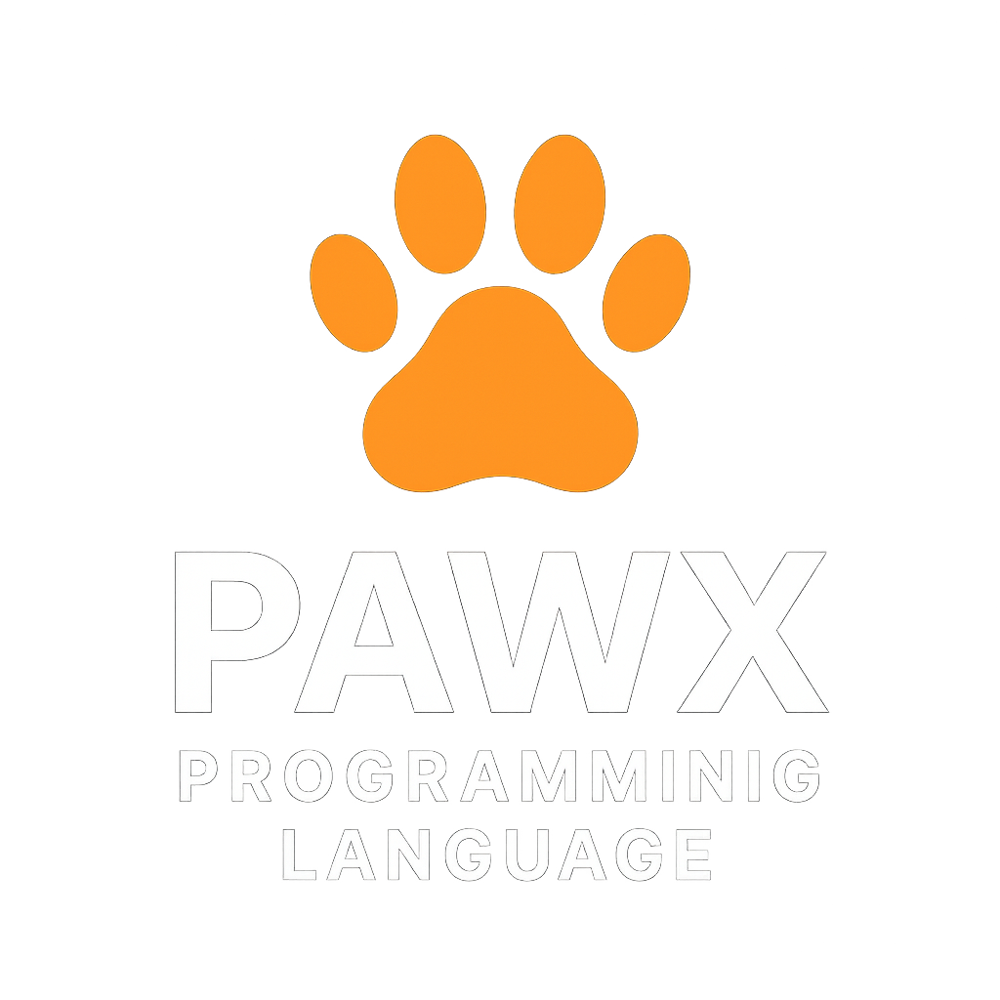

<p align="center">
  
</p>

<h1 align="center">PAWX — Code with Claws! 🐾</h1>

<p align="center">
  <a href="https://github.com/samwilcox/pawx">
    
  </a>
  <a href="https://github.com/samwilcox/pawx/blob/main/LICENSE">
    
  </a>
  <a href="https://www.rust-lang.org">
    
  </a>
</p>

<p align="center">
  A modern, expressive programming language built from scratch in <b>Rust</b>.
</p>

------------------------------------------------------------------------

## 🚀 What is PAWX?

**PAWX** is a fully custom-built programming language and runtime
designed for:

-   ✅ Clean, expressive syntax
-   ✅ Safe, sandboxed execution
-   ✅ First-class functions & lambdas
-   ✅ Objects, arrays, tuples, and classes
-   ✅ Node.js-style filesystem API
-   ✅ Promise-style async via `Furure`
-   ✅ True interpreted execution

------------------------------------------------------------------------

## ✨ Language Highlights

``` pawx
snuggle add = (a, b) -> {
    return a + b;
};
```

``` pawx
snuggle cat = {
    name: "Trouble",
    age: 3
};

snuggle names = ["Sam", "Mike", "Alvin"];
```

``` pawx
snuggle point = (10, 20);
```

``` pawx
i++;
i--;
```

------------------------------------------------------------------------

## 📁 Built-in Filesystem API

### ✅ Synchronous

``` pawx
Fs.readText(path)
Fs.writeText(path, text)
Fs.appendText(path, text)
Fs.readBytes(path)
Fs.writeBytes(path, bytes)
Fs.exists(path)
Fs.readdir(path)
Fs.mkdir(path, recursive?)
Fs.rm(path, recursive?)
Fs.readJson(path)
Fs.writeJson(path, value)
```

### ✅ Promise-Style Async

``` pawx
Fs.writeTextAsync("./test.txt", "Async write!")
  .then(() -> {
      meow("Write OK!");
  })
  .catch(err -> {
      meow("Error!");
      meow(err);
  })
  .finally(() -> {
      meow("Cleanup done.");
  });
```

------------------------------------------------------------------------

## 🧠 Under the Hood

-   Recursive-descent parser
-   Strong AST typing
-   Lexical scoping environment
-   Prototype-based object model
-   Class & instance system
-   Thread-safe promise emulation
-   Native Rust function bridging

------------------------------------------------------------------------

## 📦 Project Status

✅ Lexer & parser
✅ Expression evaluation
✅ Statements & control flow
✅ Functions & closures
✅ Classes & instances
✅ Arrays, objects, tuples
✅ Regex support
✅ Filesystem (sync + async)
✅ Promise-style Futures (`Furure`)

------------------------------------------------------------------------

## 🛠 Running PAWX

``` bash
pawx test.px
```

------------------------------------------------------------------------

## 📜 License

PAWX is **dual-licensed** under:

-   MIT License
-   Apache License, Version 2.0

https://license.pawx-lang.com

------------------------------------------------------------------------

## 👤 Author

Sam Wilcox
https://www.pawx-lang.com
sam@pawx-lang.com
https://github.com/samwilcox

------------------------------------------------------------------------

**PAWX --- Code with Claws.**
